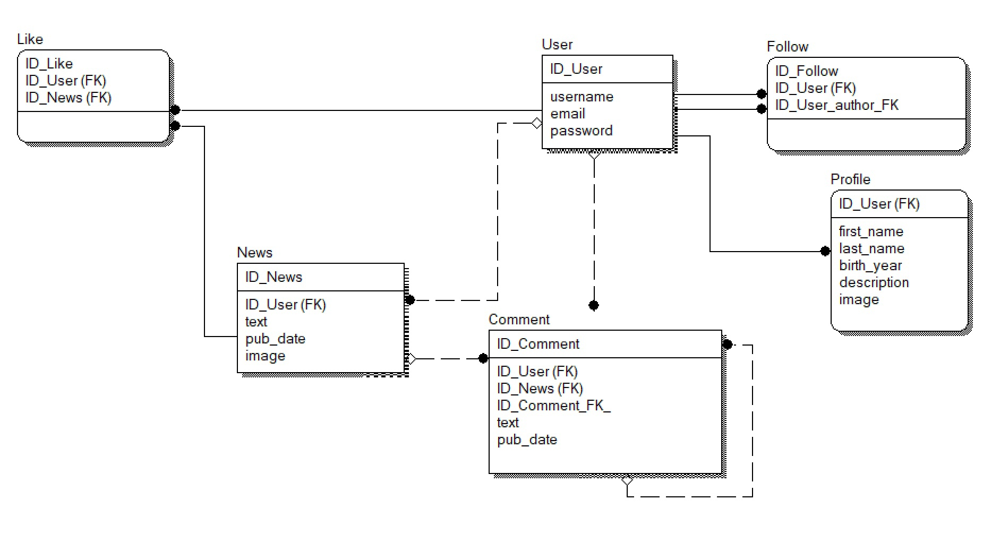

# Серверная часть приложения для новостей
Тестовое задание DevAppBroseph

 

## Бизнес постановка:

Необходимо создать сервисы, позволяющие каждому из пользователей создать 
свой канал с аватаркой, описанием и возможностью постить новости, 
получать подписчиков, ставить реакции, комменты и ответы к ним. 
У заказчика уже есть вся информация о зарегистрированных пользователях.

## Критерии оценивания:

- Спроектирована и нормализована физическая схема базы данных (ERwinDataModeler, DrawIO или др.)
- Спроектированы и разработаны интерфейсы позволяющие управлять данными на основе RestAPI или graphql
- Интерфейсы покрыты E2E тестами и документацией (Swagger или др.)
- Созданные сервисы поднимаются в докер контейнере и успешно проходят тестирование

Решение необходимо выложить на GitHub и отправить @Kir_SR до 18.02.23

## Схема базы данных

 

## Запуск приложения в контейнерах
- Сборка образа выполняется из директории News_upp/infra

```python 
docker-compose up -d --build 
```

- Выполнение миграций

``` python 
docker-compose exec web python manage.py migrate
```

- Сбор статики 

``` python 
docker-compose exec web python manage.py collectstatic --no-input
```

- Создание суперюзера

```python 
docker-compose exec web python manage.py createsuperuser
```

### Документация 
http://127.0.0.1/swagger/

### Автор
- Веревкина Диана
